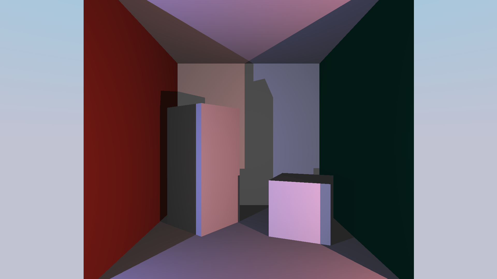
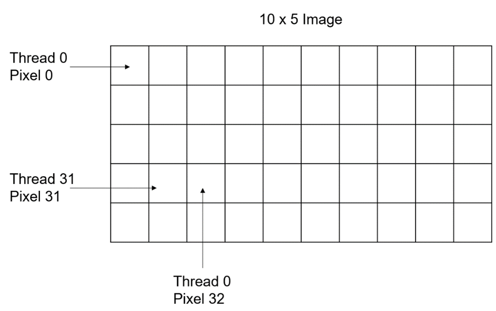
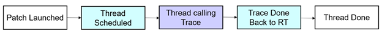
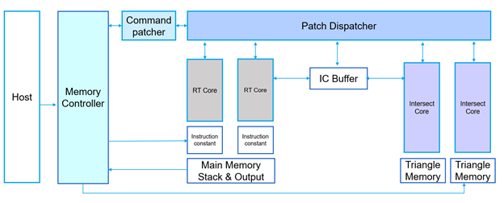
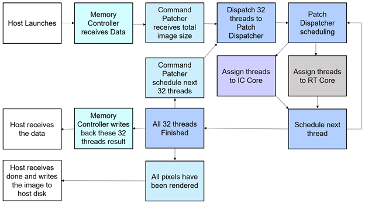

# Hardware Ray-tracing Graphical Processor

This project is the work of Team KEVIN on a dedicated graphical processor for ray tracing. It is completed under the supervision of Mikko Lipasti and aims to implement and streamline the process of ray tracing in software and hardware. Inspired by current GPU architecture, we designed a multi-thread processor that can render millions of pixels on the hardware. RT-core is a general-purpose compute unit and the smallest component in our hardware. It can run one thread at a time with our custom ISA that supports 32-bit floating-point and vector operations. Four of such compute units and eight ray-triangle intersection accelerators (IC core) form streaming multiprocessors (SM), and it can take up to 32 threads at the same time. The host will provide a launch size (usually width * height of the image), and our hardware will split it into 32 thread wrap and assign them to each SM. Currently, we only have one SM in our design, but it can effortlessly scale up to any number.

Alongside with our hardware, we created a complier and a assembler to transform C like language, Kevin++, into machine code. We also wrote a assembly simulator that can simulate one pixel using assembly code and Kevin++ simulator that can run Kevin++ in C. The image at the front is our demo code. It is a physically based shader written in Kevin++ and simulated in C.

Our system is targeted at Intel FPGA and Intel Devcloud. 
# What you might find useful in this Repo
- [RT Core](https://github.com/zyd2001/ECE554-RayTracing-TeamKEVIN/tree/master/Hardware/RT_Core_and_Components): Five stage pipelined CPU with floating point and vector support.
- [Intel floating-point and fix-point IP](https://github.com/zyd2001/ECE554-RayTracing-TeamKEVIN/tree/master/Hardware/IP): Generated Intel IPs with latency. Examples about how to integrate Intel IP into your design can be found here [FPU](https://github.com/zyd2001/ECE554-RayTracing-TeamKEVIN/tree/master/Hardware/RT_Core_and_Components/Float_alu.sv).
- [IC Core](https://github.com/zyd2001/ECE554-RayTracing-TeamKEVIN/tree/master/Hardware/IC) & [Triangle Memory](https://github.com/zyd2001/ECE554-RayTracing-TeamKEVIN/tree/master/Hardware/mem_triangle.sv): Ray-triangle intersection accelerator.
- [Patch Dispatcher](https://github.com/zyd2001/ECE554-RayTracing-TeamKEVIN/tree/master/Hardware/patch_dispatcher.sv) & [16 Bank Memory](https://github.com/zyd2001/ECE554-RayTracing-TeamKEVIN/tree/master/Hardware/mem_main.sv): Examples about how to schedule a multi-threaded system and support multi-thread memory operations.
- [Ray-generation kernel and PBR shader](https://github.com/zyd2001/ECE554-RayTracing-TeamKEVIN/tree/master/Software/Real_RT_instruction_simulation): Simple pinhole camera model and physically based shader using roughness/metallic.
# Current Progress
✔ All components written and integrated 

✔ All components successfully passed simulation

✔ Mapping complete

✔ MMIO and DMA passed the tests on real FPGA

✔ IP on FPGA works as expected

✔ Generate images from real FPGA
# Architecture 

    

Each thread will be assigned with a thread ID and pixel ID, telling pixel they are responsible to. Then each thread will start executing instruction at position 0. They will terminal when FIN is called. For more information, please refer to the document.

    

# Micro Architecture 

    

Our hardware aims to supports all the functionality we defined in the Architecture Chapter. Host and self-made memory controller work together through DMA and MMIO interface to move instructions and triangles from host to chip and move the chip to the host. 

Host will tell the Command Patcher the total number of Pixels and it will break them into a 32-thread chunk. Then it will assign this chunk to Patch Dispatcher. It will also communicate with host when a patch has completed and move the output back to the host. 

Patch dispatcher is responsible for scheduling 32 thread to 4 RT Core and 8 IC Core. When a thread evoke trace, it will push this thread to a queue and assign a new thread to this RT Core. It interacts with IC Core in a similar fashion. When all 32 threads have completed, it will signal the Command Patcher that it is ready for the next 32 threads.

RT Core is a generic CPU core with vector and floating-point support and the intersection core is a hardware accelerator. It utilizes the Möller-Trumbore algorithm to achieve a faster execution. The RT Core passes the ray information to IC Buffer. The intersection cores fetch triangle information from triangle memory. A pipeline is used to reduce the down time of the hardware, utilizing the advantages of the algorithm. 

Since the Instruction memory, triangle memory and the constant memory is read-only to all the thread, we can simply duplicate them to avoid bank conflict. Each RT Core has its own Instruction and Constant memory, and each IC Core has its own Triangle memory. However, RT Core can read-write main memory therefore we have a unified main memory for all the RT Core.

    

# How to run simulation on AFU_ASE
You can test this project in a simulated environment.

`git clone` this repository

open 2 terminals, `~/opae/bin/tool_setup.sh` in both terminals

## Hardware terminal

`cd Hardware`

`./auto.sh`
This script will compile system verilog files and start simulation.

## Software terminal

`cd Software/Host`

There are many files in this folder

+ `main.kpp` the software source code that will run on the core
+ `main.asm` the software assembly code compiled by our compiler
+ `Assembler.py` the assembler
+ `RT.isa` ISA specification file used by the assembler
+ `box.binary` a sample triangles binary file for the image in the report
+ `CP.binary` specify how many pixels to render
+ `constant.binary` binary for constant memory

all these `.binary` files can be generated by a series of python scripts in Software/Assembler folder. There will be a README file that explain all the scripts

Since the compiler is written in C# and if you don't have .Net SDK installed, I have a link for the stand-alone compiler executable (for linux). https://uwmadison.box.com/s/4i22j2tx7aves5ogfz65plreysjjr908. To compile, run `./CompilerCore main.kpp > main.asm`.
For convinence, I also include the compiled result (`main.asm` file).

`./Assembler.py -r main.asm` or `python3 ./Assembler.py -r main.asm` to assemble the assembly

`make` to build the host software.

After hardware simulation start, make sure to set the `ASE_WORKDIR` according to the Hardware terminal's prompt.

`ASE_LOG=0 ./afu_ase` to run. Several `get` and a `break` will be printed in a while. Then the output image will be written to `output.ppm`. The example here is at `16×12` resolution (for faster simulation).

# How to build and run on real FPGA

# Documents
[Architectural and Micro Architectural Document](./Outputs/A%26MA.pdf)
